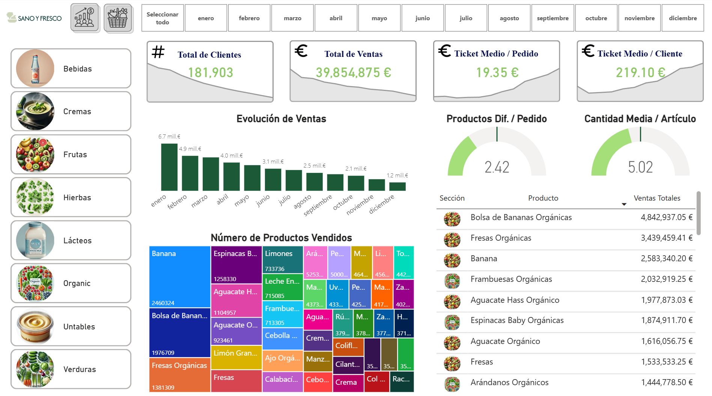
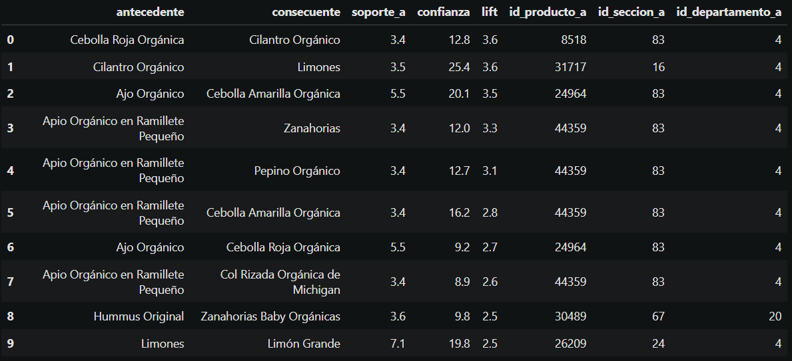
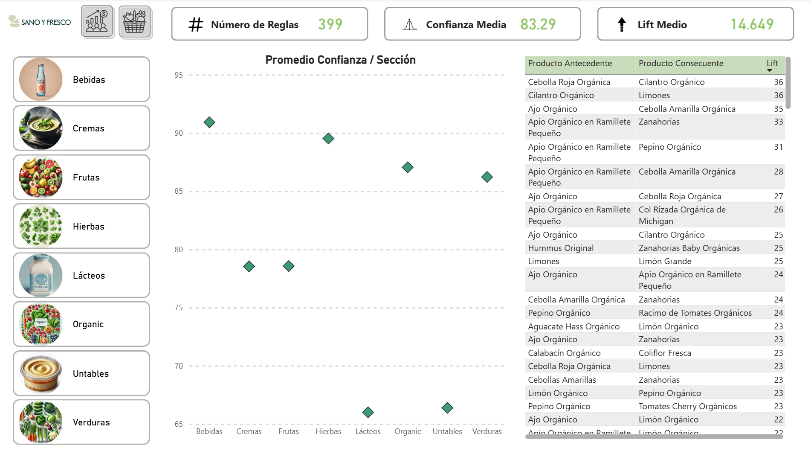

# Recomendación de Productos

## Descripción:
Este proyecto utiliza datos de una tienda de productos comestibles para realizar un análisis orientado a mejorar la experiencia del cliente. A partir de las preferencias seleccionadas por el usuario, se generarán recomendaciones personalizadas de productos. Además, los principales KPIs serán visualizados en un dashboard interactivo en Power BI.

## Tabla de Contenidos 
- [Datos](#datos)
- [Procedimiento](#metodología)
- [Resultados](#resultados)
- [Conclusiones](#Conclusiones)

## Datos 
- El dataset utilizado proviene de "Mi Primera Experiencia como Data Analyst".
- Los datos son de distintos productos alimenticios de una tienda, el archivo excel cuenta con más de 1 millos de registros.

## Procedimiento

### 1. Obtención de KPIs de los Registros
- La primer hojo de Power BI se trabajó con los datos de excel, se realizaron algunas transformaciones para mejorar el resultado.
- También se usó otro archivo excel donde se almacenaban los URLs de los productos, relacionarlo con la tabla principal mediante sus claves, para luego poder usarlos en el Dashboard.

### 2. Implementar Metodología de Market Basket Analysis
- Se decidió trabajar con los registros para obtener una forma de recomendar productos según lo que seleccionó previamente el cliente.
- Se realizó la exploración de datos, luego se implementaron los métodos para la recomendación de productos.
- Al procesar todos los datos se obtuvo una tabla con los productos y con los siguientes medidores:
  - Producto A: Es el producto que compra el consumidor.
  - Producto B: Es el posible producto a ser comprado después por el consumidor.
  - Soporte: Es la frecuencia con la que aparece en producto Antecedente.
  - Confianza: Es la probabilidad que se compre el producto b si ya se compró el producto A.
  - Lift: Es una métrica que indica si la relación de A y B no es solo una coincidencia.

### 3. Almacenar los Datos
- Para finalizar se almacena los datos en un archivo .csv, para luego poder usarlo en Power BI y obtener más insights. 

### 4. Mostrar los Nuevos Valores
- Con el nuevo archivo Excel, se utiliza para hacer una nueva hoja en Power BI donde se mostrará la relación de los productos, el posible producto a ser comprado después, el Lift y la Confianza.

## Resultados
- Se logró obtener la información de la mayoría de los PDFs sin problemas.
- También se pudo realizar una Dashboard decente que muestre los gastos de la persona/empresa que se realizaron en el año 2018.
